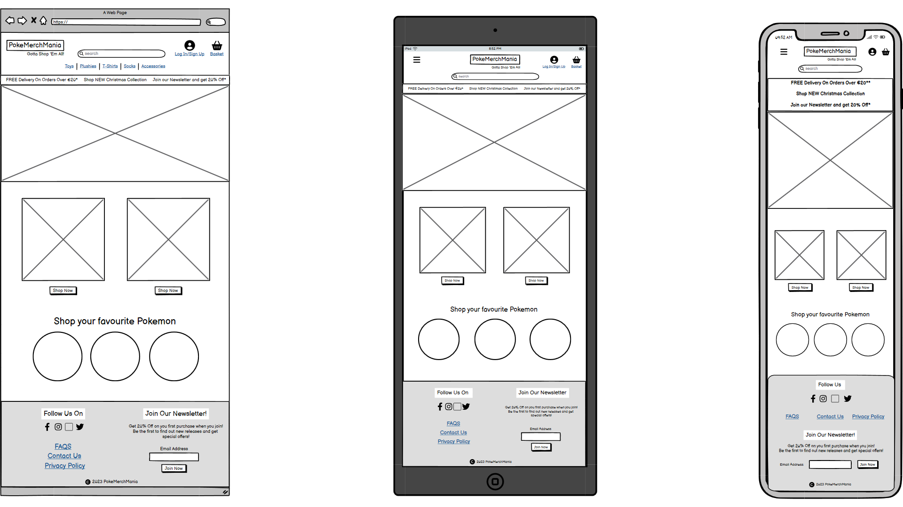
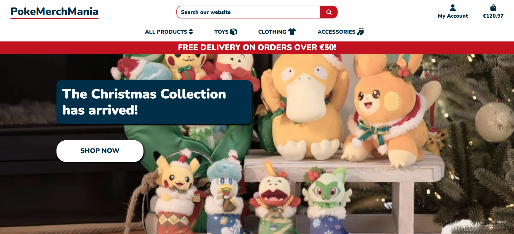
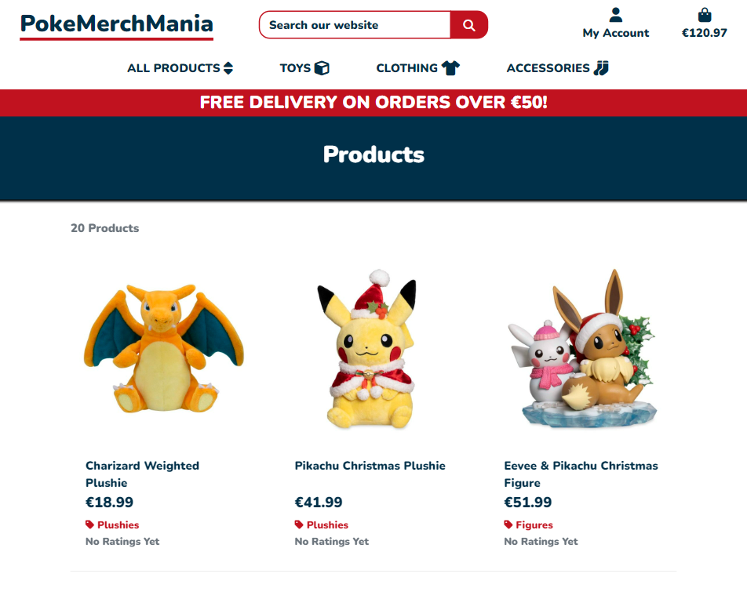
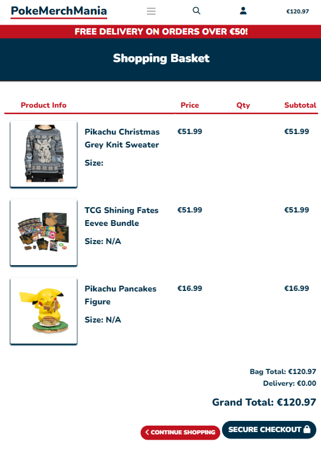

# **PokeMerchMania**

 

 

## **Table of Contents**

- [**PokeMerchMania**](#pokemerchmania)
  - [**Table of Contents**](#table-of-contents)
      - [**User Stories:**](#user-stories)
      - [**Wireframes:**](#wireframes)
        - [**Home Page:**](#home-page)
        - [**Products Page:**](#products-page)
        - [**Product Details Page:**](#product-details-page)
        - [**Shopping Basket Page:**](#shopping-basket-page)
    - [**Media**](#media)

#### **User Stories:**

* As a **User** I want...
  * ...**Clear and simple navigation of the website** so that I can **easily find the products I'm interested in.**
  * ...**The website to be usable with screen readers and other assistive technologies** so that I can **have an inclusive browsing experience.**
  * ...**To search for products based on keywords** so that I can **quickly locate specific items.**

#### **Wireframes:**

 

 

##### **Home Page:**

 

 

##### **Products Page:**

 

 

##### **Product Details Page:**

 

 

##### **Shopping Basket Page:**

 

 

### **Media**  

* ALL Products images have been taken from the following site
  * [Pokemon Center](https://www.pokemoncenter.com/)