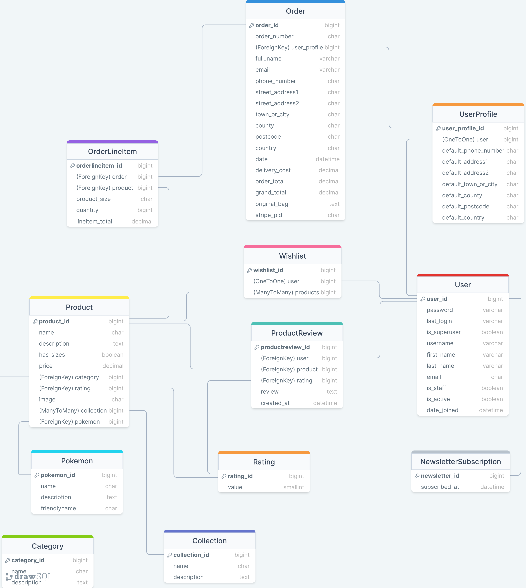

# **PokeMerchMania**

 

 

 

## **TABLE OF CONTENTS**

- [**PokeMerchMania**](#pokemerchmania)
  - [**TABLE OF CONTENTS**](#table-of-contents)
  - [**INTRODUCTION**](#introduction)
  - [**USER EXPERIENCE (UX)**](#user-experience-ux)
    - [**User Stories**](#user-stories)
  - [**AGILE METHODOLOGY**](#agile-methodology)
  - [**THE SCOPE**](#the-scope)
    - [**The Site's Main Goals**](#the-sites-main-goals)
  - [**DESIGN**](#design)
    - [**Colours**](#colours)
    - [**Typography**](#typography)
  - [**DATABASE SCHEMA**](#database-schema)
  - [**WIREFRAMES**](#wireframes)
  - [**FEATURES**](#features)
    - [**Full Home Page:**](#full-home-page)
      - [**Products Page:**](#products-page)
      - [**Product Details Page:**](#product-details-page)
      - [**Shopping Basket Page:**](#shopping-basket-page)
  - [**DEPLOYMENT**](#deployment)
    - [**Version Control**](#version-control)
    - [**Heroku Deployment**](#heroku-deployment)
  - [**CREDITS**](#credits)
    - [**Technology used**](#technology-used)
    - [**Code**](#code)
    - [**Media**](#media)

 

 

## **INTRODUCTION**

Welcome to PokeMerchMania - where a treasure trove of Pokemon goodies await your discovery!

Crafted with love for every Pokemon Trainer, whether you're a seasoned pro or just starting your quest, visit our site and embark on a journey to collect 'em all. Unveil the magic of our exclusive Christmas themed collection and dive into the thrill of finding the perfect Pokemon plushie, t-shirt, keychain, and beyond!

So what are you waiting for? Add a dash of Pokemon magic to your life and make your collection truly legendary. Gotta shop 'em all, only at PokeMerchMania!

 

 

## **USER EXPERIENCE (UX)**

### **User Stories**

As a User I want:

- Clear and simple navigation of the website so that I can easily find the products I'm interested in.
- The website to be usable with screen readers and other assistive technologies for an inclusive browsing experience.
- To search for products based on keywords to quickly locate specific items.
- To filter products based on categories, collection, and Pokémon to narrow down my choices.
- To browse through different categories of Pokémon products to explore a variety of options.
- To view products associated with specific Pokémon (e.g., Pikachu, Eevee, Charizard) to discover merchandise featuring my favourite Pokémon.
- To see details about a specific product, including its description, price, and available sizes for informed decision-making.
- To see products grouped into collections (e.g., Seasonal, Limited Edition) to discover themed merchandise.
- To find information about shipping costs and return policies for products to make informed purchase decisions.
- To create an account on the platform to access personalised features and track my order history.
- To log in and log out of my account for secure access to my account.
- To update my profile information, including my shipping address to ensure accurate order delivery.
- To add products to my wishlist to save items for future consideration.
- To receive notifications and updates about new products or promotions from my newsletter subscription so that I can stay informed about the latest offerings, access exclusive promotions, and enhance my overall shopping experience.
- To reset my password in case I forget it for account security.
- To add products to my shopping basket for a convenient and organised shopping experience.
- To view and modify the contents of my shopping basket to review and adjust my selected items.
- To proceed to checkout and place an order to complete my purchase.
- To receive email confirmation after placing an order for order tracking and verification.
- To leave reviews and ratings for products to share my experiences with others.
- To save my shopping basket for future sessions so that I can easily continue my shopping experience later.

As Admin I want:

- To add, update, and delete products to manage the product catalogue.
- To manage product categories, collections, and Pokémon to organise and update merchandise.
- To view and manage user reviews and ratings for quality control.
- To monitor and manage user orders for efficient order processing.
- To access and respond to customer support enquiries to address user concerns promptly.
- To sort products by price, rating, category, and alphabetically for better decision-making.

 

 

## **AGILE METHODOLOGY**

To strategise the project's development and execution, an Agile Tool in the form of a project Kanban board was employed via Github. The project board utilised issues represented as "User Stories". You can access the board through this [link](https://github.com/users/IanaLois/projects/4).

 

 

## **THE SCOPE**

### **The Site's Main Goals**

1. **Merchandise Appeal:** Present a distinctive selection of Pokemon merchandise that captivates and resonates with the interests of Pokemon fans.

2. **Effortless Navigation:** Ensure a user-friendly interface for easy exploration and smooth shopping experiences.

3. **Comprehensive Product Showcase:** Showcase a diverse range of Pokemon merchandise, including toys, clothing, and accessories.

4. **Secure Shopping:** Implement robust security measures to guarantee safe and secure transactions for customers.

5. **Seasonal Collections:** Regularly update and promote themed collections, like the Christmas collection, to keep offerings fresh and appealing.

6. **Customer Interaction:** Cultivate customer engagement through reviews, ratings, and social media integration to build a thriving community.

7. **Efficient Order Management:** Provide users with easy order tracking and management options for a hassle-free shopping experience.

8. **Responsive Customer Support:** Establish responsive customer support channels to address inquiries, concerns, and feedback promptly.

9. **Mobile Responsiveness:** Ensure a seamless shopping experience across various devices, with a focus on mobile responsiveness.

 

 

## **DESIGN**

### **Colours**

 

Colour Palette

 

 

The colour scheme for this project was created in [Coolors](https://coolors.co/) and the inspiration was drawn from the iconic Poke Ball.

- #C1121F (Poke Ball Red): This vibrant red colour is instantly recognisable as the primary colour of a Poke Ball. It conveys energy, excitement, and passion.

- #FFFFFF (Poke Ball White): This clean and neutral white colour is instantly recognisable as the secondary colour of a Poke Ball. It complements the vibrant red, creating a visually appealing contrast. White is often associated with cleanliness and can enhance the overall readability of text and other elements on the website.

- #003049 (Dark Blue): This dark blue colour adds depth and sophistication to the colour palette. It contrasts well with both red and white, creating a balanced and visually pleasing combination.

Together, these colours not only capture the essence of Pokemon with the Poke Ball reference but also create a sleek and visually appealing aesthetic. The colour palette is likely to evoke a sense of nostalgia for Pokemon fans, especially with the subtle nod to the video game colours. Additionally, the combination of red, white, and dark blue creates a harmonious blend that can contribute to a polished and engaging user experience on the PokeMerchMania website.

 

### **Typography**

 

 

## **DATABASE SCHEMA**

 

 

 

## **WIREFRAMES**

Homepage

 

 

 

## **FEATURES**

### **Full Home Page:**

 

 

#### **Products Page:**

 

 

#### **Product Details Page:**

 

 

#### **Shopping Basket Page:**

 

 

 

## **DEPLOYMENT**

### **Version Control**

PokeMerchMania was created using [Codeanywhere](https://codeanywhere.com/) and pushed to [GitHub](https://github.com/).

- `git status` command was used to display the status of changes as untracked, modified, or staged in the working directory and staging area.

- `git add .` command was used to stage all changes in the working directory and its subdirectories for the next commit.

- `git commit -m “commit message”` command was used to create a new commit in the Git repository with a specified commit message.

- `git push` command was used to upload local repository content to a remote repository.

 

### **Heroku Deployment**

**Requirement and Procfile**

- `pip3 freeze --local > requirements.txt` command was used to create a `requirements.txt` file.
- A new file named `Procfile` was created and a line of code `web: gunicorn poke_merch_mania.wsgi:application` was added.
- Then everything was pushed to the repository.

**Creating the Heroku App**

- Navigate to the Dashboard after logging into [Heroku](https://www.heroku.com/).
- Select **"New"** and then **"Create new app".**
- Name the app and then select the closest region.
- Click **"Create app"** to confirm.

**Creating the Database**

- Navigate to the Dashboard after logging into [ElephantSQL](https://www.elephantsql.com/).
- Select **"Create New Instance".**
- Choose the **Tiny Turtle (Free)** plan and **Name** it, leaving the **Tags** section blank.
- Click **"Select Region"** and select the closest data center.
- Click **"Review".**
- If all details are correct, select **"Create instance".**
- Return to the Dashboard and click on the **database instance name** of the project.
- In the URL section, copy the database URL.
- Ensure that Django and Gunicorn are installed in your workspace by executing the command `pip3 install Django==3.0.1` and `pip3 install gunicorn==21.2.0`.
- Similarly, confirm the installation of the database infrastructure by running `pip3 install dj-database-url==0.5.0` and `pip3 install psycopg2==2.9.9`
- Then `pip freeze > requirements.txt` command was used to update the requirements.txt file.

**The env.py file**

- A `env.py` file must be present in the working directory and included in the `.gitignore` file.
- At the top of the `env.py` file, add the line of code `import os`.
- Below that add the following lines:

  `os.environ["DATABASE_URL"] = "copied URL from ElephantSQL database"`  
  `os.environ["SECRET_KEY"] = "create a secret key of your own or use a random key generator"`  

- Import the environment variables into the `settings.py` file.
- Then run `python3 manage.py migrate` in the terminal window to migrate the data structure to the database instance.

**Heroku Config Vars**

- Navigate to the Heroku Dashboard and select the **"Settings"** tab in the app that was just created.
- Click **"Reveal Config Vars"**.
- Add the following:  

  `DATABASE_URL` - `copied database URL from ElephantSQL`  
  `DISABLE_COLLECTSTATIC` - `1`  
  `SECRET_KEY` - `copied secret key`  

**Connecting to GitHub and Deploy**

- Navigate to the Heroku Dashboard and select the **"Deploy"** tab in the app that was just created.
- Choose GitHub as the preferred deployment method.
- Locate the project repository by name and click **"Connect"** to establish the connection.
- Select **"Enable Automatic Deploys"** if desired.
- Lastly, select **"Deploy Branch"** to initiate the deployment process and observe the app being built.

 

 

## **CREDITS**

### **Technology used**

- [Codeanywhere](https://codeanywhere.com/) was used for creating the full project in a cross-platform cloud IDE.
- [Git](https://git-scm.com/) was used for version control in the project.
- [GitHub](https://github.com/) was used for hosting and collaborating on the Git repositories created with Codeanywhere and Git.
- [Heroku](https://www.heroku.com/) was used for deploying, scaling, and managing applications in the cloud.
- [ElephantSQL](https://www.elephantsql.com/) was used for managing PostgreSQL databases in the cloud.
- [miniWebtool](https://miniwebtool.com/django-secret-key-generator/) was used to generate a random secret key.
- [Coolers](https://coolors.co/) was used for the project's colour scheme.
- [DrawSQL](https://drawsql.app/diagrams) was used to design the database diagram.
- [Balsamiq](https://balsamiq.com/) was used to create the wireframes.
- [WhiteNoise](https://whitenoise.readthedocs.io/en/latest/index.html) was used to serve the static files.

### **Code**

- The project closely follows the code in The Code Institutes Boutique Ado project.

### **Media**

- The images featured in this project are sourced from [Pokemon Center](https://www.pokemoncenter.com/), and I do not own any of the products depicted.